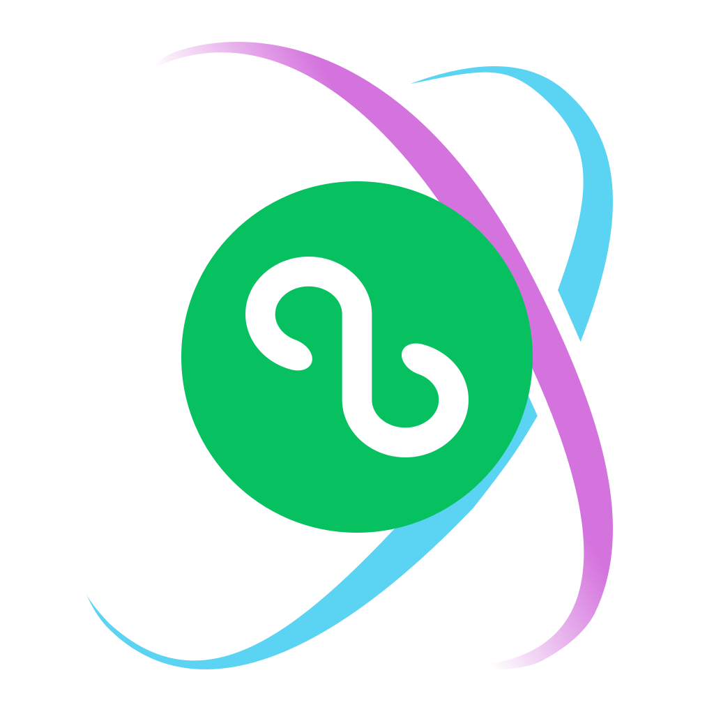

# weapp-stylex 品牌素材

当前标识采用 **A「双轨环抱」**，将小程序圆标置于 StyleX 官方青紫双轨中央。



| 文件                                                | 用途                                     |
| --------------------------------------------------- | ---------------------------------------- |
| [logo.svg](logo.svg)                                | 可编辑的矢量标识                         |
| [logo.png](logo.png)                                | 1024 × 1024 透明 PNG                     |
| [avatar.png](avatar.png)                            | 1024 × 1024 白底 PNG，GitHub 组织头像    |
| [concepts/](concepts/)                              | 五套方案、原始素材、深浅底预览和设计说明 |
| [对比图](concepts/comparison.png)                   | 五个版本的静态总览                       |
| [完整下载](concepts/weapp-stylex-logo-concepts.zip) | 全部候选素材的压缩包                     |

五个方案为 A 双轨环抱、B 负形合印、C 曲线交织、D 叠合徽章、E 几何双环。每套均保留 SVG、透明 PNG 和深浅底 PNG。

交互预览无需构建工具，在仓库根目录启动静态服务后访问对应页面：

```bash
python3 -m http.server 8769 --bind 127.0.0.1
```

打开 <http://127.0.0.1:8769/assets/brand/concepts/>，可切换背景和图标尺寸。

原始小程序图形来自用户提供的 `Vector.svg`，保存在 [wechat-miniprogram.svg](concepts/sources/wechat-miniprogram.svg)。StyleX 图形来自 [官方 favicon](https://stylexjs.com/favicon.svg)，2026-10-09 核对，原文件保存在 [stylex-official.svg](concepts/sources/stylex-official.svg)。A–D 使用官方原始路径，E 参考其轨道语言重绘。上游标识的权利归原权利人所有。
