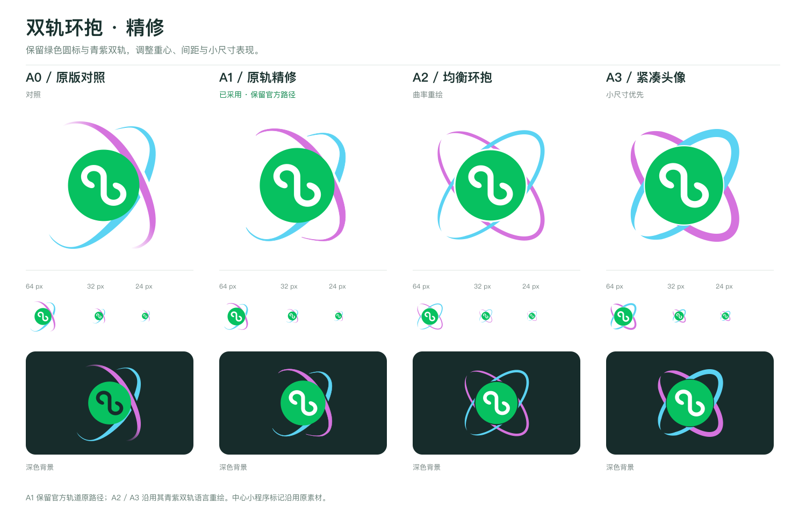

# 双轨环抱精修

**正式采用 A1「原轨精修」**（2026-10-09）。仓库正式素材位于 [logo.svg](../../logo.svg)、[logo.png](../../logo.png) 和 [avatar.png](../../avatar.png)；其他版本保留作为设计记录。

| 版本        | 设计变化                                                                               | 适用方向         |
| ----------- | -------------------------------------------------------------------------------------- | ---------------- |
| A0          | 此前采用的标识，保留作为对照                                                           | 原版             |
| A1 原轨精修 | 保留官方轨道路径，压低轮廓，放大中心圆标，移除渐隐并补充细线宽度，白色内部标记固定填充 | 正式标识         |
| A2 均衡环抱 | 沿用青紫双轨语言重绘曲率，左右轮廓呼应，中心与轨道保留间隙                             | 更规整的图形     |
| A3 紧凑头像 | 增大中心圆标并加粗双轨                                                                 | 小尺寸头像和图标 |

每个精修版本提供可编辑 SVG、1024 × 1024 透明 PNG 和白底头像 PNG。打开 `index.html` 可比较背景与 24–176px 尺寸；页面还展示 16px 样本。完整素材见 [压缩包](weapp-stylex-orbit-refinements.zip)。

中心小程序图形沿用用户提供的原素材。A1 使用 [官方 StyleX 图形](../../concepts/sources/stylex-official.svg) 的轨道路径，调整缩放、填充及细线宽度；A2、A3 为参考其轨道语言的重绘。
